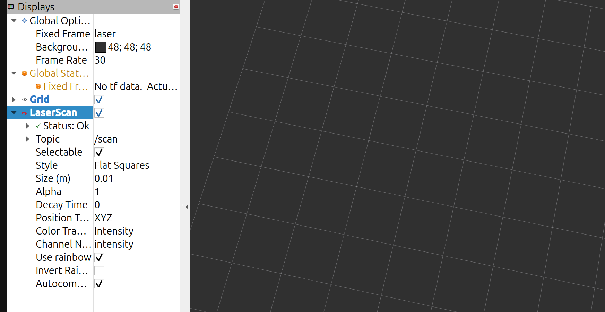

# RB3302 Final Project 

This repository contains two ROS 2 workspaces for the RB3302 final project:

- `robot_ws` contains the robot-side nodes used by the lab setup to activate the 2D Lidar, IMU, robot model, and transform definitions.
- `student_ws` contains the mapping and planning packages used in this project.

Both workspaces are located inside `~/rb3302_final_proj_code`.

Packages in this workspace:

```text
mapping_cartographer  - Cartographer algorithm
planning_astar        - Planning with A*
planning_rpp          - Planning with Regulated Pure Pursuit (RPP)
```

## Initialise the Robot

Run this from `robot_ws` before mapping or planning.
Keep this terminal running.

Build once:

```bash
cd ~/rb3302_final_proj_code/robot_ws
colcon build --symlink-install
source ~/rb3302_final_proj_code/robot_ws/install/setup.bash
```

Start the robot-side nodes:

```bash
source ~/rb3302_final_proj_code/robot_ws/install/setup.bash
ros2 launch robot_init robot.launch.py
```

Manual driving:

```bash
source ~/rb3302_final_proj_code/robot_ws/install/setup.bash
ros2 run waverover_base keyboard_teleop
```

On your own computer:

```bash
rviz2
```



## Build

```bash
cd ~/rb3302_final_proj_code/student_ws
source /opt/ros/jazzy/setup.bash
colcon build --symlink-install
source install/setup.bash
```

## Mapping with Cartographer

Config file:

```text
src/mapping_cartographer/config/cartographer.lua
```

Start mapping:

```bash
ros2 launch mapping_cartographer mapping.launch.py
```

Drive the robot around while Cartographer creates the map.

## Save the Map

Keep mapping running, then open another terminal:

```bash 

mkdir -p ~/rb3302_final_proj_code/student_ws/maps

ros2 run nav2_map_server map_saver_cli -f  ~/rb3302_final_proj_code/student_ws/maps/rb3302_map

```

Save maps here:

```text
~/rb3302_final_proj_code/student_ws/maps/rb3302_map.yaml
~/rb3302_final_proj_code/student_ws/maps/rb3302_map.pgm
```

## Before Using A* or Regulated Pure Pursuit (RPP)

Both planning options use Adaptive Monte Carlo Localisation (AMCL) to localise the robot on the saved map.
After starting either planning package, set the robot's starting pose in RViz with `2D Pose Estimate`, then send a goal.


## Planning with A*

Config file:

```text
src/planning_astar/config/nav2_params.yaml
```

Start planning:

```bash
ros2 launch planning_astar planning.launch.py
```

## Planning with Regulated Pure Pursuit (RPP)

Config file:

```text
src/planning_rpp/config/nav2_params.yaml
```

Start planning:

```bash
ros2 launch planning_rpp planning.launch.py
```
